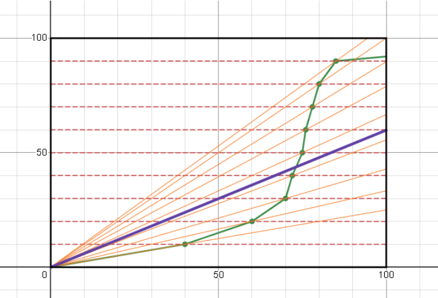

# Introducing the Parayil Metric for obtaining Performance-Complexity graphs of machine learning models

<h3>Introduction</h3>
In this research project, I invented a novel mathematical method, including what I call the Parayil Metric, to obtain Performance-Complexity graphs of machine learning models. Even though they would be of extreme value, such Performance-Complexity graphs have largely remained elusive in the field of machine learning due to various fundamental challenges. I have overcome these challenges using my Parayil Metric. I am applying this method to evaluate the comparative performance of the Q-Learning and Deep Q-Learning models over differing discrete environment complexities.
  
The point of this repository is to present what I believe is a very valuable contribution to the field of machine learning.
 
<h3>Performance-Complexity Graph</h3>
A Performance-Complexity (PC) graph or a Time-Complexity graph depicts the relationship between the performance of an algorithm to the complexity of the task or environment. In computational sciences, these are very common and powerful for algorithm analysis, comparison, and optimization. 
  

 <i>Figure 1: Time-complexity graph of common Big-O notation examples
 Image source: Adrian Mejia, adrianmejia.com/how-to-find-time-complexity-of-an-algorithm-code-big-o-notation/, accessed on 4/30/2024.</i>
 
 However, in the context of machine learning, such PC graphs depicting algorithm performance on learning a task over differing environment/task complexities are mostly absent, even though they would be highly valuable in the analysis of machine learning algorithms. The reason for this is due to the infeasibility of obtaining singular metrics for both machine learning model performance and environment complexity.
 In this research project, I overcome these fundamental challenges by inventing a novel mathematical method, involving what I have named the Parayil Metric. I am applying this method in the comparative analysis of the RL models Q-Learning (QL) and Deep Q-Learning (DQN) for their PC graphs.  

<h3>Getting a singular metric for machine learning performance</h3>

To construct a PC graph of a given machine learning model, I would have to be able to obtain a single numerical value that describes how well and fast the model learned at a certain environment.   
The data that we have, however, is a learning graph, a relationship between the timesteps of training and the performance over time. Over more timesteps or iterations of training, the model will generally become more adept.  
Converting a learning graph to a singular metric of how "good" the model trained is not straightforward. While there exists techniques such as finding the area under the graph, these are not well-suited methods for evaluating how good a learning graph is.
 
LEARNING GRPAH IMAGE
 
Additionally, obtaining a learning graph in the first place is not always straightforward. Due to epsilon decay, which applies in the algorithms of QL and DQN, doing a single run-through of the training process to obtain a learning graph in that way is not possible, because the number of total timesteps trained set to train for affects the rate of epsilon decay, which in turn skews the learning graph. To obtain a singular point of the learning graph, one would have to run the training process all the way until that point, and restart the process for another point, which quickly becomes overly time consuming.

<h3>Parayil Metric</h3
My solution was to kill these two birds with one stone, by inventing the Parayil Metric. The Parayil Metric aims to obtain a single numeric value to describe the nature of a given learning graph. 

How the Parayil Metric works is that it splits the y-values (performance, in terms of percentage win rate) into fixed intervals (ex: : 5%, 10% [...] 90% 95% 100%). For each of these y values, I find the corresponding x value (timestep). In other words, I find what is the timestep that yields an average win rate closest to the given y value. If the agent is not able to achieve the given win rate ever, an x value of infinity is assigned.  I then transform the x-values from timesteps to actual physical time. So I would run tests determining on average how much time does it take to run the given amount of timesteps of training, running plenty of trials to account for randomness and differences in computational resources.  For each of these transformed x-y pairs, I find the slopes by dividing the y over the x. Finally, the Parayil Metric would then be the average of all these slope values. 
  
Such a metric takes into account learning over time and is appropriately sensitive to performance limits that the algorithm may encounter in the environment. The Parayil Metric of one algorithm can then be compared with that of another algorithm, to find the comparative performance on a given environment. Additionally, it is applied in constructing the performance-complexity graph. 
  
Another benefit of using the Parayil Metric is that I only need to run timestep tests specifically for the y-value intervals, instead of scanning the entire timestep space (which would take astronomically long due to the epsilon decay problem). To find the corresponding x value of each y value, I use the binary search algorithm, which is normally used for searching for items in a list, but can be applied in this case quite well.
   
<h4>Parayil Metric Demonstration</h4>

<i> Figure 2: Visual demonstration of Parayil Metric using desmos
 Image source: myself, using desmos</i>
  
In the above image, the green graph represents a dummy hypothetical learning graph.  
The horizontal dotted red lines represent the split Y-axis into fixed intervals.  
The green dotted points are the intersections of the horizontal dotted red lines and the learning graph, representing the x-y value pairs.  
The orange lines represent the slope values for each of these point pairs.  
The purple line represents the average slope of all the given orange lines. The slope of this orange value is then the final Parayil Metric. 
Note: Although not visible, here are horizontal lines at 100% and 0%. The point at 100% does not exist, so we treat the X-value as infinite. The orange line for that point (infinity, 100%), would have a slope  of 0, and is also not visible, but nevertheless significantly affects the average Parayil Metric.  

  
<h3>Getting a singular metric for environment complexity</h3>
To construct a PC graph, I would also need a singular metric for environment complexity (complexity of a reinforcement learning environment). However, this comes with its own set of challenges.  
The complexity of an environment is a complex thing to measure. There are countless factors that could affect the "complexity" of an environment. So assigning a singular numerical score of the complexity of an environment is not straightforward.  
I did not address this problem nearly as elaborately I did the last. How I calculated the complexity metric is by simply multiplying the environment's discrete state size and action space.  
Although this ignores the countless other factors that affect complexity, in the context of my current goal, which was to evaluate the comparative performance of QL and DQN over the different discrete Toy Text environments from Gymnasium, I believe it is sufficient.  
  

<h3>Evaluating the comparative performance of Q-Learning and Deep Q-Learning Network over discrete environment complexities</h3>
The original research project originated with the goal of shedding light on the interesting differences in performance between QL and DQN depending on the environment complexity.  
DQN is a much more advanced model than QL, and can handle much more complex environments. However, in my research, I demonstrated that QL can actually outperform DQN when it comes to very small environment complexities. And here there was an extreme difference too. The Parayil Metric of QL on FrozenLake 4x4 was about 55 times greater than the Parayil Metric than DQN, which means that QL outperformed DQN with a ratio of 55 to 1 in terms of performance. 
So, if QL outperforms DQN at small environment complexities, but DQN outperforms QL at larger environment complexities, there must exist a point in terms of environment complexity at which these two models converge. This is how my investigation of obtaining PC graphs began.  
I invented the Parayil Metric and an elegantly efficient method to overcome several fundamental challenges and construct a PC graph for any machine learning model.  
Unfortunately, due to computational time constraints, I was not able to actualize the PC graph for QL and DQN just yet. This is because, although my invented methodology is very efficient, the very nature of evaluating machine learning performance means that I would have to run many (a hundred or so) repetitive trials of the machine learning training process, which quickly adds up. 
